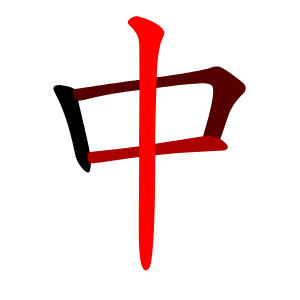

# AnimCJK



## Description

The purpose of this project is to display kanji and kana (Japanese characters) or hanzi (simplified and traditional Chinese characters) stroke by stroke.

For a demo, see http://gooo.free.fr/animCJK/official

For each character, there is one or several svg files in AnimCJK repository that contains paths defining its shape and some css code to animate it. The name of the svg is the decimal unicode of the character followed by the "svg" extension.

## SVG files

SVG files are stored in several folders.

The svgsJa folder contains svg files corresponding to the union of the Japanese "jōyō kanji" (2136 characters), the Japanese "jinmeyō Kanji" (862 characters) and 90 Japanese "hyōgai Kanji". As a result, svgsJa folder contains 3088 characters.

The svgsKana folder contains svg files corresponding to the Japanese "hiragana" (86 characters) and Japanese "katakana" (91 characters). As a result, svgsKana folder contains 177 characters.

The svgsZhHans folder contains svg files corresponding to Chinese "commonly used simplified hanzi" (7000 characters) and 61 "uncommon hanzi in a text written in simplified hanzi". This set includes the "HSK hanzi" (2663 characters) and the "frequently used simplified hanzi" (3500 characters).

The svgsZhHant folder contains svg files corresponding to Chinese "HSK 1 traditional hanzi" (197 characters). Note that some simplified characters have more than one corresponding traditional character.

Take care because characters are not always the same in Japanese and in Chinese even when they share the same unicode. For instance 勉 (21193.svg) in Japanese has not the same shape as 勉 (21193.svg) in Chinese.

Take care of compatibility characters such as 勉 (64051.svg) that has in Japanese the same shape as 勉 (21193.svg) in Chinese, but has not the same unicode.

Each svg can be inserted as is in a web page, or with some modifications using for instance javascript.

## Usage

First, you have to download animCJK somewhere on your computer (then evenly upload it on a webserver).

### Basic usage

Just insert a svg file representing a character as is in a web page.

For instance, you can use php (assume that you moved or uploaded animCJK repository on a php server). Write the code below in a file called simple.php and store it in the samples folder of AnimCJK. Then run simple.php in a browser.
```
<!doctype html>
<html>
<head>
<meta charset="UTF-8">
<meta name="viewport" content="initial-scale=1.0,user-scalable=yes">
<style>
svg.acjk
{
	width:256px;
	height:256px;
}
</style>
<title>Simple usage of AnimCJK</title>
</head>
<body>
<h1>Simple usage of AnimCJK</h1>
<?php
include "../svgsJa/20013.svg"; // include Japanese 中
?>
</body>
</html>
```
Alternately, you can use HTML and Javascript. Write the code below in a file called simple.html and store it in the samples folder of AnimCJK. Then run simple.html in a browser.
```
<!doctype html>
<html>
<head>
<meta charset="UTF-8">
<meta name="viewport" content="initial-scale=1.0,user-scalable=yes">
<title>Simple usage of AnimCJK</title>
<style>
svg.acjk
{
	width:256px;
	height:256px;
}
</style>
</head>
<body>
<h1>Simple usage of AnimCJK</h1>
<div id="svgBox"></div>
<script>
function loadSvg()
{
	var xhr=new XMLHttpRequest();
	xhr.onreadystatechange=function()
	{
		if ((xhr.readyState==4)&&(xhr.status==200))
			document.getElementById("svgBox").innerHTML=xhr.responseText;
	};
	xhr.open("GET","../svgsJa/20013.svg",true); // get Japanese 中
	xhr.send(null);
}
window.addEventListener("load",loadSvg,false);
</script>
</body>
</html>
```
### Anki cards

You can insert svg files as HTML code in Anki card's note fields. 

For instance, using Anki card editor, select "Recto" field of a card's note, then click on the "hamburger" icon, select the menu that allows to modify the HTML and paste the content of any AnimCJK svg file representing a character anywhere in the HTML code.

### Other usages

Several samples are provided to show how to use AnimCJK.
These samples are stored in the samples folder.
See also http://gooo.free.fr/animCJK/official/samples

Using php, javascript or any other languages, you can easily modify svg files in order to change size of characters, colors, animation duration, etc.
- to insert several characters in the same page, see animeSeveral.html.
- to change colors of a character, see color.php and red.php.
- to change the size of a character, see size.php.
- to change the speed of drawing a character, see speed.php.

See other samples for more usages.

### Support of browsers than cannot animate svg properly

Some browsers (notably Microsoft browsers) cannot animate svg properly. A workaround for these browsers is provided with the samples.

However, the market share of these browsers is constantly decreasing. So it is conceivable (in 2018) to remove this workaround to simplify your code. 

## Technical details

To animate a character, AnimCJK uses the following method: the character shape is split in several paths (one per stroke). These paths (called "stroke" paths) are used as clip-path, and dashed lines (called "median" paths) are drawn over these paths. The space between two dashes is large enough to cover the whole path. Initially, the path is covered by a space of the dashed line. Using a css animation, one moves the position of the dashed line. As a result, one has the impression that the strokes are drawn gradually. See https://css-tricks.com/svg-line-animation-works/ for more details.

If several characters are inserted in the same page (for instance if one want to display "一二三"), and if one need to animate them one after the other, one has to modify the animation-delay of each stroke in the css of the svg. If a character is displayed several times in the same page (for instance if one want to display "谢谢"), one also need to modify the id of its elements. This can be done using javascript. Alternately, one can encapsulate each svg in an iframe.

Note: some kana (those which have a stroke overlapping on itself as あ, ぬ etc.) are special. The stroke which overlaps is split in several parts. So automatic procedures on these characters require some specific codes.

Note: some characters have special versions stored in folders that have the "Special" suffix. These versions have some strokes split in several parts in order to be able to show the radical of characters like 由, 甲, etc. See "Radical" sample to see how it works. If you don't intend to show the radical of characters in a different color when drawing a character, you don't need to use these special versions.

## Decomposition system

To display components of a character in different colors, a specific decomposition system to AnimCJK called "acjk" can be used. "acjk" decompositions are stored in dictionaryJa.txt, dictionaryZhHans.txt, etc.

An "acjk" decomposition starts with a character, followed by its number of stroke (which indicates that the character is not decomposed), or followed by an ideographic description character (which indicates that the character is decomposed).
The ideographic description character is followed by several component decompositions (3 for "⿲" and "⿳", 2 for ⿰","⿱","⿴","⿵","⿶","⿷","⿸","⿹","⿺" and "⿻).
If a component has no corresponding character to represent it, its decomposition just starts with the ideographic description character.
If a component has no corresponding character to represent it and no decomposition, its decomposition starts by a "?" followed by its number of stroke.
A component may be represented by a character that has more strokes than it, followed by the decomposition of the component instead of the representing character.
A component may be represented by a character that has a different glyph, but is semantically the same as the component.
Special case 1: when a component is also the radical of the main character, a special mark is inserted just after the component character (actually a ".").
Special case 2: sometimes, a component is split in several parts (when some strokes of other components are drawn "between" its parts). In such a case, each part is represented by a specific decomposition starting with the component character which is split, followed by a special mark (actually a ":"), followed by the decomposition of this part.
When there is more than one special mark, the radical special mark is inserted first.
It is mandatory to decompose a component which contains the radical of the main character. It is optional to decompose other components.
If a character has several possible decompositions, just concatenate them.

## Plugin for Wordpress

A plugin for Wordpress to insert animated kanji in a webpage using BBCode can be downloaded at:

http://gooo.free.fr/animCJK/animkanji_wp_plugin_page.php

## Related works

### Makemeahanzi

This project is derived from the remarquable Makemeahanzi project which is designed to display Chinese characters. See https://github.com/skishore/makemeahanzi for more details. Many characters were modified or added in AnimCJK (between three or four thousand at the moment) for various reasons:
- many Japanese characters have a different stroke order, or have a different glyph, or have a different stroke direction or are not commonly used in Chinese, and therefore have no entry in Makemeahanzi.
- many Chinese traditional characters have a different stroke order, or have a different glyph, or have a different stroke direction or have no entry in Makemeahanzi.
- many character shapes were just slightly modified to look prettier.
- some commonly used (but not frequently used) Chinese characters have no entry in Makemeahanzi. 

Even if character shapes have the same look in both Makemeahanzi and AnimCJK, the svg files are different: the css is different, the svg structure is different, the coordinate system is different, the stroke paths are different, the median paths are different. However, for people who would like to re-import characters from AnimCJK to Makemeahanzi, text files are provided (graphicsJa.txt, graphicsZhHans.txt, etc.) that have the same format as the graphics.txt file of Makemeahanzi. So it is easy to generate SVG files in the format used by Makemeahanzi using AnimCJK data.

### Arphic PL KaitiM GB and Arphic PL UKai fonts

Makemeahanzi itself makes an extensive use of the Arphic PL KaitiM GB and Arphic PL UKai fonts generously provided by Arphic Technology.

Many characters of AnimCJK are not present in these fonts (especially but not exclusively Japanese characters since these Arphic fonts are designed for Chinese). One used parts of other characters to design these missing characters and/or used various editors (mainly Inkscape and BBEdit) to modify their shape. One didn't use any other fonts to make these characters.

### Animated_GIF

Some samples use Animated_GIF.js script.

Animated_GIF.js script comes from Animated_GIF project.

Part of magicAcjk.js script is derived from Animated_GIF sample called "basic".

See https://github.com/sole/Animated_GIF for more details about Animated_GIF project.

### String.codePointAt and String.fromCodePoint polyfills

Some javascript scripts use polyfills for String.codePointAt and String.fromCodePoint functions. These polyfills are stored in codePoint.js script.

These polyfills come from https://github.com/mathiasbynens/String.codePointAt and https://github.com/mathiasbynens/String.fromCodePoint projects.

### References

We used various sources to cross-check our data. In particular:
- Wiktionary, https://en.wiktionary.org/ (all characters)
- Kakijun, https://kakijun.jp/ (Japanese characters)
- KanjiVG, http://kanjivg.tagaini.net/viewer.html (Japanese characters)
- ArchChinese, https://www.archchinese.com/chinese_english_dictionary.html (Chinese characters)
- Taiwanese Minister Of Education, https://stroke-order.learningweb.moe.edu.tw/characters.do?lang=en (Chinese characters used in Taiwan)
- Hong-Kong Education Bureau, https://www.edbchinese.hk/lexlist_en/ (Chinese characters used in Hong-Kong)
- Naver Hanja Dictionary, https://hanja.dict.naver.com/ (Korean characters)
- OpenCC, https://github.com/BYVoid/OpenCC (correspondence between simplified and traditional Chinese characters)
- Commons Chinese characters decomposition, https://commons.wikimedia.org/wiki/Commons:Chinese_characters_decomposition (Chinese characters decomposition)
- CJK Decomposition Data, https://archive.codeplex.com/?p=cjkdecomp (Chinese characters decomposition)
- Hanzi Yuan, http://hanziyuan.net/ (Chinese characters etymology)
- Shufa Ai, http://www.shufaai.com/a/zidian/zi/ (various images of Chinese characters)

### Miscellaneous
- How SVG Line Animation Works, https://css-tricks.com/svg-line-animation-works/

## What is new?

Minor enhancements and minor updates can be skipped.

2022/11/16
- modify Japanese stroke order of 韭
- minor enhancement of glyphs and/or medians of 音目貼律只沌墓徴田傾艶西溜蛐曲回看豕豸澪濡瀕四白百自塡塗隔煩憎網油徠德徽図学文正気空金
- various minor updates

2022/11/15
- 韋: modify simplified Chinese stroke order
- minor enhancement of glyphs and/or medians of 章羊趣進泊欲復皇聖難署宀囗陥尋冫
- various minor updates

2022/11/14
- add "Compute medians" sample which can automatically recalculate medians
- minor enhancement of glyphs and/or medians of 待囲匸教幸息研階竣靴徒固芽確価績層磁債圈昌
- various minor updates

2022/11/11
- minor enhancement of glyphs and/or medians of 田白汐国番間
- modify Japanese 拷 8th stroke direction

2022/11/09
- modify Japanese glyph of 曜濯燿耀躍拐考条督微称弥祢顧与写判酸新薪親述術垂唾睡錘鬱
- modify Japanese stroke order of 堕謹僅謹勤
- various minor updates

2022/11/07
- svgsJa/27595.svg (毋), svgsJa/32786.svg (耒), svgsZhHans/34381.svg (虍): put the &lt;def&gt; tag at the right place 

2022/11/04:
- 積: modify Japanese stroke order

2022/10/31:
- 周: replace 吉 by 𠮷 in decomposition (first stroke is shorter now)
- 捨: replace 舍 by 舎 in ja decomposition (⿰扌舍 in zh, ⿰扌舎 in ja)

2022/10/27:
- fixed a bug in a median of 覗 that caused graphicsJa.txt to be a wrong json file
- fixed a bug in a median of 延 and 抽 that caused graphicsZhHans.txt to be a wrong json file
- 似剣労: fix (tiny) bugs in medians

2022/10/23:
- fix some minor errors in dictionaryJa.txt and dictionaryZhHans.txt

2022/06/30:
- fix a bug in function setNumber() in index.html and samples/number.php (see issue #22)
- 黹: modify glyph of the 6th and 7th strokes in svgsJa
- 雌: modify 5th stroke (glyph in svgsJa, stroke direction in svgsZhHans)
- 笑: modify 7th stroke (glyph and stroke direction in svgsJa and svgsZhHans)
- 円靑: improve glyph of 円 in svgsJa and 靑 in svgsJa and svgsZhHans
- 谢耋徘薯: improve glyph in svgsZhHans
- 勧観: update decomposition (𮥶 component was missing)

2022/01/19:
- fix a bug in graphicsKana.txt
- add makeGraphicsFromSvgs4Kana.php script to build graphicsKana.txt

2021/12/01:
- improve "ゐ"
- fix svg tag bug in 40860.svg in svgsZhHans (龜)
- 骨: modify stroke order in svgsJa
- 韋: modify stroke number in svgsJa and improve in svgsZhHans
- improve 鳥 in svgsJa and in svgsZhHans

2021/11/29:
- add Kangxi radicals not already in svgsJa or svgsZhHans (because they are not jōyō or jinmeyō kanji or not commonly used simplified hanzi)
- in svgsJa: 丨丶丿亅亠儿冂冖冫几 凵勹匕匚匸卩厂厶囗夂 夊宀尢尸屮巛幺广廴廾 弋彐彡彳戈戶攴无曰歹 殳毋气爻爿疒癶禸网耒 聿舛艮艸虍襾豕豸辵釆 隶隹靑韋韭髟鬥鬯鬲鹵 麥黍黹黽鼠齒龜龠
- in svgsZhHans: 丨丶丿亅亠冂冖冫凵勹 匚匸卩厶囗夂夊宀尢屮 巛廴廾彐彡戶攴疋疒癶 禸糸艸虍襾見貝車辵釆 長門隹靑韋頁風飛馬髟 鬥魚鳥鹵麥黃黽齊齒龍 龜

2021/11/27:
- add 篭罠囁呟醤噛梱塡繍繋壷覗 in svgsJa
- replace 填 by 塡 in the jōyō kanji list
- move 填 in the hyōgai kanji list

2021/11/23:
- add graphicsKana.txt

2021/06/20:
- fix a error in the median of the 5th stroke of 抽

2020/07/23:
- improve "の"

2019/04/29:
- replace 卜 by ⺊ in decomposition of 上, 占, etc.

2019/03/28:
- fix bug in 12388.svg (つ kana).

2019/01/27:
- various minor updates,
- various shape and stroke order updates.

2018/12/16:
- remove css calc() from svg files (poorly supported),
- various shape and stroke order updates.

2018/12/14:
- add Infinite sample,
- various minor updates.

2018/12/07:
- add traditional hanzi for HSK 1 (197 characters),
- rewrite all the samples,
- support of browsers that cannot animate SVG properly in samples,
- various minor shape or stroke order updates,
- various other minor updates.

## Licences

In summary, you can freely redistribute and/or modify the files of this project under the terms of 3 licenses:
- Arphic Public License (files prefixed by "graphics" and SVG files excepting those that are in svgsKana folder),
- MIT license (Animated_GIF.js and codePoint.js scripts),
- GNU Lesser General Public License (all other files including SVG files that are in svgsKana folder).

See https://github.com/parsimonhi/animCJK/blob/master/licenses/COPYING.txt for more details about licences concerning this project.
