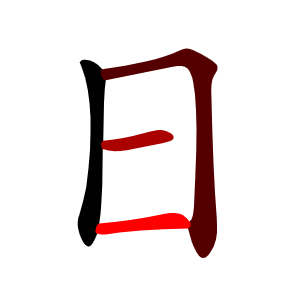
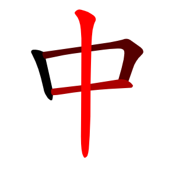

# AnimCJK



## Description

The purpose of this project is to display kanji and kana (Japanese characters), hanja (Korean characters) or hanzi (simplified and traditional Chinese characters) stroke by stroke.

For a demo, see http://gooo.free.fr/animCJK/official

For each character, there is one or several svg files in AnimCJK repository that contains paths defining its shape and some css code to animate it. The name of the svg is the decimal unicode of the character followed by the "svg" extension.

## SVG files

SVG files are stored in several folders.

The svgsJa folder contains svg files corresponding to the union of the Japanese "jōyō kanji" (2136 characters), the Japanese "jinmeyō Kanji" (863 characters), some Japanese "hyōgai Kanji", components, and the 35 basic strokes. In all, svgsJa folder contains 3718 characters.

The svgsKana folder contains svg files corresponding to the Japanese "hiragana" (86 characters) and Japanese "katakana" (91 characters). As a result, svgsKana folder contains 177 characters.

The svgsKo folder contains svg files corresponding to Korean "hanja level 8, 7, 6, 5", some of the level 4, and some other characters. In all, svgsKo folder contains 521 characters.

The svgsZhHans folder contains svg files corresponding to Chinese "commonly used simplified hanzi" (7000 characters), and some "uncommon hanzi", "traditional hanzi" (that can appear in a simplified hanzi text), components and the 35 basic strokes. This set includes the "HSK hanzi" (2663 characters) and the "frequently used simplified hanzi" (3500 characters). In all, svgsZhHans folder contains 7522 characters.

The svgsZhHant folder contains svg files corresponding to Chinese "HSK v3 level 1 and HSK v3 level 2 traditional hanzi" (602 characters) and some other characters. Note that some simplified characters have more than one corresponding traditional character. As a result, svgsZhHant folder contains 764 characters.

Be careful because the characters are not always the same in all languages even when they share the same unicode. For instance 勉 (21193.svg) in Japanese has not the same glyph as 勉 (21193.svg) in Chinese.

Pay attention to compatibility characters such as 勉 (64051.svg) which has the same glyph in Japanese as 勉 (21193.svg) in Chinese, but does not have the same unicode.

Each svg can be inserted as is in a web page, or with some modifications using for instance javascript.

## Usage

First, you have to download animCJK somewhere on your computer (then evenly upload it on a webserver).

### Basic usage

Just insert a svg file representing a character as is in a web page.

For instance, you can use php (assume that you moved or uploaded animCJK repository on a php server). Write the code below in a file called simple.php and store it in the samples folder of AnimCJK. Then run simple.php in a browser.
```
<!doctype html>
<html>
<head>
<meta charset="UTF-8">
<meta name="viewport" content="initial-scale=1.0,user-scalable=yes">
<style>
svg.acjk
{
	width:256px;
	height:256px;
}
</style>
<title>Simple usage of AnimCJK</title>
</head>
<body>
<h1>Simple usage of AnimCJK</h1>
<?php
include "../svgsJa/20013.svg"; // include Japanese 中
?>
</body>
</html>
```
Alternately, you can use HTML and Javascript. Write the code below in a file called simple.html and store it in the samples folder of AnimCJK. Then run simple.html in a browser.
```
<!doctype html>
<html>
<head>
<meta charset="UTF-8">
<meta name="viewport" content="initial-scale=1.0,user-scalable=yes">
<style>
svg.acjk
{
	width:256px;
	height:256px;
}
</style>
<title>Simple usage of AnimCJK</title>
</head>
<body>
<h1>Simple usage of AnimCJK</h1>
<figure id="svgBox"></figure>
<script>
window.addEventListener("load",function(){
	fetch("../svgsJa/20013.svg") // get Japanese 中
	.then(r=>r.text())
	.then(r=>document.getElementById("svgBox").innerHTML=r);});
</script>
</body>
</html>
```
### Anki cards

You can insert svg files as HTML code in Anki card's note fields. 

For instance, using Anki card editor, select "Recto" field of a card's note, then click on the "hamburger" icon, select the menu that allows to modify the HTML and paste the content of any AnimCJK svg file representing a character anywhere in the HTML code.

### Other usages

Several samples are provided to show how to use AnimCJK.
These samples are stored in the samples folder.
See also http://gooo.free.fr/animCJK/official/samples

Using php, javascript or any other languages, you can easily modify svg files in order to change size of characters, colors, animation duration, etc.
- to insert several characters in the same page, see animeSeveral.html.
- to change colors of a character, see color.html, rainbow.html or red.html.
- to change the size of a character, see size.html.
- to change the speed of drawing a character, see speed.html.

See other samples for more usages.

## Technical details

To animate a character, AnimCJK uses the following method: the character shape is split in several paths (one per stroke). These paths (called "stroke" paths) are used as clip-path, and dashed lines (called "median" paths) are drawn over these paths. The space between two dashes is large enough to cover the whole path. Initially, the path is covered by a space of the dashed line. Using a css animation, one moves the position of the dashed line. As a result, one has the impression that the strokes are drawn gradually. See https://css-tricks.com/svg-line-animation-works/ for more details.

If several characters are inserted in the same page (for instance if one want to display "一二三"), and if one need to animate them one after the other, one has to modify the animation-delay of each stroke in the css of the svg. If a character is displayed several times in the same page (for instance if one want to display "谢谢"), one also need to modify the id of its elements. This can be done using javascript. Alternately, one can encapsulate each svg in an iframe.

Note: some kana (those which have a stroke overlapping on itself as あ, ぬ etc.) are special. The stroke which overlaps is split in several parts. So automatic procedures on these characters require some specific codes.

Note: some characters have special versions stored in folders that have the "Special" suffix. These versions have some strokes split in several parts in order to be able to show the radical of characters like 由, 甲, etc. See "Radical" sample to see how it works. If you don't intend to show the radical of characters in a different color when drawing a character, you don't need to use these special versions.

## Decomposition system

To display components of a character in different colors, a specific decomposition system to AnimCJK called "acjk" can be used. "acjk" decompositions are stored in dictionaryJa.txt, dictionaryZhHans.txt, etc.

An "acjk" decomposition starts with a character, followed by its number of stroke (which indicates that the character is not decomposed), or followed by an ideographic description character (which indicates that the character is decomposed).
The ideographic description character is followed by several component decompositions (3 for "⿲" and "⿳", 2 for ⿰","⿱","⿴","⿵","⿶","⿷","⿸","⿹","⿺" and "⿻).
If a component has no corresponding character to represent it, its decomposition just starts with the ideographic description character.
If a component has no corresponding character to represent it and no decomposition, its decomposition starts by a "?" followed by its number of stroke.
A component may be represented by a character that has more strokes than it, followed by the decomposition of the component instead of the representing character.
A component may be represented by a character that has a different glyph, but is semantically the same as the component.
Special case 1: when a component is also the radical of the main character, a special mark is inserted just after the component character (actually a ".").
Special case 2: sometimes, a component is split in several parts (when some strokes of other components are drawn "between" its parts). In such a case, each part is represented by a specific decomposition starting with the component character which is split, followed by a special mark (actually a ":"), followed by the decomposition of this part.
When there is more than one special mark, the radical special mark is inserted first.
It is mandatory to decompose a component which contains the radical of the main character. It is optional to decompose other components.
If a character has several possible decompositions, just concatenate them.

## Plugin for Wordpress

A plugin for Wordpress to insert animated kanji in a webpage using BBCode can be downloaded at:

http://gooo.free.fr/animCJK/animkanji_wp_plugin_page.php

## Related works

### Makemeahanzi

This project is derived from the remarquable Makemeahanzi project which is designed to display Chinese characters. See https://github.com/skishore/makemeahanzi for more details. However many characters have been modified (or added) in animCJK for various reasons:
- many Japanese and Korean characters have a different stroke order, or have a different glyph, or have a different stroke direction or are not commonly used in Chinese, and therefore are not in Makemeahanzi.
- many Chinese traditional characters have a different stroke order, or have a different glyph, or have a different stroke direction or are not in Makemeahanzi.
- many character shapes were just slightly modified to look prettier.
- some commonly used (but not frequently used) Chinese characters are not in Makemeahanzi.
- some uncommon characters are not in Makemeahanzi.

Even if character shapes have the same look in both Makemeahanzi and AnimCJK, the svg files are different: the css is different, the svg structure is different, the coordinate system is different, the stroke paths are different, the median paths are different. However, for people who would like to re-import characters from AnimCJK to Makemeahanzi, text files are provided (graphicsJa.txt, graphicsZhHans.txt, etc.) that have the same format as the graphics.txt file of Makemeahanzi. So it is easy to generate SVG files in the format used by Makemeahanzi using AnimCJK data.

### Arphic PL KaitiM GB and Arphic PL UKai fonts

Makemeahanzi itself makes an extensive use of the Arphic PL KaitiM GB and Arphic PL UKai fonts generously provided by Arphic Technology.

Many characters in AnimCJK are not present in these fonts (especially but not exclusively Japanese characters since these Arphic fonts are designed for Chinese). One used parts of other characters to design these missing characters and/or used various editors (mainly Inkscape and BBEdit) to modify their shape. One didn't use any other fonts to make these characters.

### Animated_GIF

Some samples use Animated_GIF.js script.

Animated_GIF.js script comes from Animated_GIF project.

Part of magicAcjk.js script is derived from Animated_GIF sample called "basic".

See https://github.com/sole/Animated_GIF for more details about Animated_GIF project.

### References

We used various sources to cross-check our data. In particular:
- Wiktionary, https://en.wiktionary.org/ (all characters)
- Kakijun, https://kakijun.jp/ (Japanese characters, stroke order, kaishotai kanji)
- Moji kakudai, https://moji.tekkai.com/ (Japanese characters, kaishotai kanji)
- KanjiVG, http://kanjivg.tagaini.net/viewer.html (Japanese characters, stroke order)
- ArchChinese, https://www.archchinese.com/chinese_english_dictionary.html (Chinese characters)
- Qianpian https://zidian.qianp.com/ (Chinese characters)
- Taiwanese Minister Of Education, https://stroke-order.learningweb.moe.edu.tw/characters.do?lang=en (Chinese characters used in Taiwan)
- Hong-Kong Education Bureau, https://www.edbchinese.hk/lexlist_en/ (Chinese characters used in Hong-Kong)
- Naver Hanja Dictionary, https://hanja.dict.naver.com/ (Korean characters)
- Korean Wiki Project， https://www.koreanwikiproject.com/wiki/Category:Hanja_characters (Korean characters displayed using a Korean font in kaisho style)
- OpenCC, https://github.com/BYVoid/OpenCC (correspondence between simplified and traditional Chinese characters)
- Commons Chinese Characters Decomposition, https://commons.wikimedia.org/wiki/Commons:Chinese_characters_decomposition (Chinese characters decomposition)
- CJK Decomposition Data, https://archive.codeplex.com/?p=cjkdecomp (Chinese characters decomposition)
- Hanzi Yuan, http://hanziyuan.net/ (Chinese characters etymology)
- Shufa Ai, http://www.shufaai.com/a/zidian/zi/ (various images of Chinese characters)

### Miscellaneous
- How SVG Line Animation Works, https://css-tricks.com/svg-line-animation-works/

## What is new?

2025/01/18
- add to svgsZhHansSpecial: 矗
- improve in svgsJa: 七
- improve in svgsKo: 七
- improve in svgsZhHans: 七
- improve scripts

2025/01/17
- improve in svgsZhHant: 𡻕嵗

2025/01/16
- numerous scripts changes
- change svgsKana to svgsJaKana
- change HSK v2 (2012) char list to HSK v3 (2021) char list
- modify stroke order in svgsZhHant: 快情
- improve in all folders: 出願情為通食
- improve in svgsJa: 圥黽俳排匪悲扉斐緋誹輩覆際
- improve in svgsZhHans: 们黽睛覆餐
- improve in svgsZhHant: 原業樂晴情請睛青漂
- add in svgsJa: 坴埶
- add in svgsKo: 忄丨丶丿亅亠儿冂冖冫几
- add in svgsZhHans: 圥坴埶靠
- add in svgsZhHant: 忄乾干榦舘敎凈毛頁扉 斐祇交份低佔使例倒停 億克入全划利劃印原取 受合吹味咱喊嚮堂夜夠 套封度座庭廣弄忽愿態 拉挺掉排推收改晨普永 油活流海涼湖溫熟牆由 省碰確示科稱篇組背臟 舉英藉處裝複覆觀言計 討許論通週遍適部量閤 闆隊際隨隻雲青靠順食 餃養餐髒鬚

2025/01/07
- add ヲ in svgsKana (was missing for an unknown reason in some versions)
- various minor changes in js and php scripts

2025/01/03
- improve in all folders
	加牙
- improve in svgsJa and svgsZhHans
	傲尸艮釆溺田猫瓢髭
- improve in svgsJa
	雑餌擢摺腔麺錆灼豹曾駿樽噌哨鞘倦捲騒顚頓祥雌儲鄭盡叡韋
- improve in svgsZhHans
	渊赝戋颠渍炮镫歡呱瓞瓠瓣瓤魃魍魏魔藠鹟罽琎葖
- add to svgsJa and improve in svgsZhHans and svgsZhHant
	它
- add to svgsJa and improve in svgsZhHans
	敖崔堇餐佰蛾碍卉桓廓仇翰夭夹辨渠躯圣狐菰
	佼糠肱濠漉甑痔杓酋戎薯敞樵蒋笥蝉煽箭箪蛸
	柁蜘樗雩凋掴碇塘椴苫瀞葱匪粕簸稗弼逼穆㣎
	耆埠苓棉帛莱熔薮猷歪苒睿
- add to svgsZhHans
	弔奧㝉円凧䏌𢀖隻𠬤𠃓
- add to svgsJa
	帚扮吃卆杂于亲娄翟哥亍产脆蛋狗姑姐咳什礦聯𢇇丱摸𬀷牌甶溌趨芻擾㥑匙唖甜橡厭猒腿爺
	涌冉吋袷荏姶鯵虻飴𩙿洩嘘蔚鰻曼嬰賏盈穎掩鴛夗焔鴬鴎㝵蛙蛎厉劃畫赫姦撹橿畺畕澗侠僑
	鰹臤鰍竃𥤧苅杀潅𮥶諌兇呑舘舍妓癌翫蟻贋兑亶禀豈賈录笨矮澳擺禦彊怯粁倶轡𦆕粂卦珪畦
	鹸鹸鱚𠂭罫荊頚鈷垢狛坤鮭麹鵠鯖捌别另鮫屍屡疹宍蕊鴫蔀綬夙妾娼鋤廠尙藷鉦鍾蝕塵靭椙
	栴宁咸戌狸鱈賎糎岨匝掻𧈡糟鎗詑岱騨鐸㦮瀦苧諜銚鎚栂鍔吊嬬剃轍禿砺淘涜顛澱孛區亏圥
	鏑菟鍍鐙鴇蕩噸畷誹韮匆撚膿嚢蚤㕚楳狽矧駁蝿硲筏蛤醗噺叛釦鉾吠謬錨鋲蒜蛭鮪鮒烹庖鋪
	鰭斌僻辟糞箆笍𠔿燐粍鵡牝緬悶慾揖杢愈鑓葎牢婁聾蝋鰐儘儚憫閔檮濤漑既龝蛛褌迺鉤韃鴦
	鸚𦍒冝叧睿
- add to svgsJa and svgsZhHans
	𠈌𠫓㕣尞夰糹𠮛𬺻𰀪𠔾𠮷𠃜𦣻𠤎𢎨𢎥𪜊𰀁𧈧耂
	丅𡗗𥃭冋𥃲𠁣𠃛䖝龸𰃮𤴓𢆶旲𧰨𦍌飠夃倝㐅嵒
	倠㐭菐僉吅氺畀丌𦈢㝴匊昗劦𧾷豦朿𠂋垚㐱惢
	畐彔叚𦍎龵睪⺫巠枼咢𦉫匋夌啇叕怱肰𱼀𠀎镸
- add to svgsJa and svgsZhHans
	翏𡰪蒦囬夅㐄龹咠𠮠𡰯𤴔厃
- modify stroke order in ja
	橙燈
- modify stroke order in svgsZhHans
	毐
- modify stroke order and improve in svgsZhHans
	瀚
- modify number of strokes in zhHant
	育
- modify number of strokes in zhHans
	嚄塊魆蓇棻蒟蓂蓂蘘
- numerous decomposition improvements
- fix a bug in setNumbersAcjk.js that appeared when a median had an "H" or "V" in its "d"
- various minor updates

2024/01/10
- modify す and ず (issue #40)

2023/12/19
- fix stroke number of ヲヺ in svgsKana (issue #38)
- fix stroke order of も in svgsKana (issue #37)

2023/11/03
- add 膵 in svgsJa

2023/11/02
- fix 昇 medians (issue #35)
- fix 昇 stroke order (issue #34)

2023/07/27
- add 轤轆 in svgsJa

2023/04/25
- add 犭忄牜𤣩灬𠀃礻阝豖𫝀丂戉乇仌彥𫠠壴𥫗 (in svgsJa and svgsZhHans)
- add 电关叩开扁旁禺桀 (in svgsJa)
- add 饣钅讠 (in svgsZhHans)
- fix a bug in decompositions containing 阝
- various minor updates

2023/04/22
- add 燻 (in svgsJa), 扌 and 衤 (in svgsJa and svgsZhHans)
- various minor updates

2023/02/28
- 務: modify zhHans glyph, and decomposition everywhere
- 健楗毽犍腱: modify zhHans decomposition
- add hanja level 5 to svgsKo
- various minor updates

2023/02/25
- fixes the decomposition of 览 (issue #27)

2023/02/20
- add 々 (issue #26)
- various minor updates

2023/02/02
- 餅餌: change of glyph and stroke order in svgsJa
- add hanja level 6 to svgsKo
- various minor updates

2023/01/25
- add some traditional hanzi (hsk1, hsk2 and hsk3) in svgsZhHans (Continental China)
- add some traditional hanzi (hsk2 and hsk3) in svgsZhHant (Taiwan)
- add some hanja (level 8 and level 7) in svgsKo (Korea)
- add some uncommon or component characters
- modify some character decompositions
- modify numerous characters (minor enhancements)
- 坐: modify stroke order (permute 5th and 6th strokes)
- various minor updates

Note: there are many tiny differences (stroke order, glyph, ...) between the traditional hanzi of svgsZhHans and those of svgsZhHant.

2023/01/03
- update the licence
- remove use of asvg.js (ie browser is no longer supported)
- rewrite samples
- modify some decompositions
- add a sample: "curves"
- add two new kinds of characters: component and stroke
- add (Jinmeiyō): 渾 
- add (stroke): ㇀㇁㇂㇃㇄㇅㇆㇇㇈㇉㇊㇋㇌㇍㇎㇏㇐㇑㇒㇓㇔㇕㇖㇗㇘㇙㇚㇛㇜㇝㇞㇟㇠㇡㇢
- add (various): 亻乚𠃍丄𠂇乂𠂉丆䒑丷亇龰龶𠂒乁𠃌𠂊𡿨乛𠂌𬺰⺆亼𠆢⺊𭕄亻氵习𠃊氶业亚吕𠄎乀辶⻌⻍⻎妟𧘇卄𠃋从飞乜⺤⺥爫爫⺄⺀𠘨刂⺈㔾𠂆⺌尣兀巜𠦝龴亢肀⺕
- 亠丶丨之円一七三後白泼泽国竞鋸卒型堂塩失差图席府洁洄洇者倣傍洌洑洒洙建径徒得必成洧洨洫丢迁乔乒乓灞茀氽灏洮冱像洱冲冰决冻冼盱丿洴忏洹洺洼洽兴姪浃阪纤浇五二上六下入党浈浊测陇浍济浏运呻圻浐戦浑挙抓扳浒浓淇滂涎淫滨湟浔浕苌芹芪浙凱歼邺县听岙邱返孚饪浚剖饫饭忻识卷厂尢浞诉浠浡渌浣浥浯備鹵涂涅涌湫澧涑涓涔涕彐: minor enhancements
- various minor updates

2022/12/17
- add 𠮟 (svgsJa/134047.svg), warning: this character is not in the BMP (Basic Multilingual Plane)
- replace 叱 (svgsJa/21489.svg) by 𠮟 (svgsJa/134047.svg) in the Jōyō kanji list
- move 叱 (svgsJa/21489.svg) to the Hyōgai kanji list
- modify various scripts to handle characters that are not in the BMP (Basic Multilingual Plane)
- 由甲申电: replace 曰 by 日 in their decomposition
- 争足癫闪泄泅泐泓泔坩甙甜疳绀苷蚶邯酣钳泖泚泛泜泞泠泫倉匚泮泯泱泷泸泺泻億鷺児包皿速鉄沧謹銀沨沩沪丁飲題集酒沭配都軽転路沮沱沽黛視何沾泃仰辺財下右大手木本見青音不僧覗賴飢欄層增凉綠沥打投整淚釀憎類曆歷錄檜渚猪醉團醤梱味鍋旅昭植瑚沦橋中日板皮祭都練廣淨黃穀沟濕實壽澁者署署緖諸狀剩孃愼穗峯齊裝瘦帶滯瀧鎭燈稻賣髮賓墨與搖曾冨沤頌颯錫醇醐醍醬汾饗馨魯圓緣沁沆悔悔薗鴨奧橫價壞沉懷陷僞薰揭擊縣劍顯嚴沏沔沘沚曉圈囱櫓渚湘囟摑凹凸蘇蠟袈裟裳襖詫諺谚猪珀皓絢讃豹貰賑蕾蹟眸瞥蒔詢迪遥硯窺焰狼遁鍬隈箕囫汹粟晒晋晦智暉曙糊紬椿綾纂纏肴楯槻芹苑茅莉萄葵難萩董重蒼蔭蔣蓬梅梅蕎蕉蕃蕪九溫海囤飯亮囵燎沣沅沄沐侃牽汭瑶瓜汴畠禎商定客稀俗稔稜稟汶谣箔禪寒岸庭式想意感所窪赌储诸卤洲琢洛浬卣园淵淳淀淋湊沂况沛佞湛堪溢滉围漕菖使薦倍品員乾龠栖鼻萌漣渴灘漢紐崚佃嶺彦悉摺沫撰播佛償買乘了仁斧亩偲斯寓昂昏旷昌旸晨噌间曝沓渥柏柚洸顔風高屠绪: minor enhancements
- various minor updates

2022/11/25
- simplify the license
- remove use of codePoint.js polyfill
- replace 剥頬 by 剝頰 in the Jōyō kanji list
- move 剥頬 to the Hyōgai kanji list
- 禸禽檎璃離: modify Japanese number of strokes (禸 has 5 strokes in Japanese, even if it has only 4 strokes when handwriting), modify the glyph the same as what was done for 以
- 咽姻昧酎酌猶酬酪箇酵酷錮醜醸困循行督賂釉賊賄賜賠賦頼購霜贈瞬睦睡苗畜畔袖描幅雷瑠届憧黙鮮藩町個因啄団侑贈恩面囚飜伊楷詣套遭暦稲箸暑緒賭旭潜暫幡壕箱槽踏諧錯曖瞭闇譜韻籍響艶室省規盲眉盾眠眺眺帽諸旨旬伯縛鐘逸著響拍迫両臟皆汪旱旰父理米組藝距香泪嘗脂曹婚惜措曽晶替聞麟普僧暇鱗泡習堵日汕亥福奂留懒枨嵐悩敷楽者軸汛県借曰汜着乎殖奮竪筈汤汩汨増暮簡抽縮阳酉署著喬配酒笛宿指從富汊道首菌圏相明書昔博暑暗曜埴値権汔禸禽檎璃離污価的唱易寡織毘港晴空金國鬲由置渚混夢常铰几楢労冬分切隠劣駈細叢釆髟柑甘紺前詮北園旺畑並乗麥黍齒福春冫音目敢貼律只沌墓徴傾艶西溜蛐曲回豕豸澪濡瀕四白百自塡塗隔煩憎網徠德徽図学文正気田汐国番間章羊趣進泊欲復皇聖難署宀囗待囲匸教幸息研階竣徒固芽確価績層磁債圈昌陥尋: minor enhancements
- various minor updates

2022/11/16
- 韭: modify Japanese stroke order
- 音目貼律只沌墓徴田傾艶西溜蛐曲回看豕豸澪濡瀕四白百自塡塗隔煩憎網油徠德徽図学文正気空金: minor enhancements
- various minor updates

2022/11/15
- 韋: modify simplified Chinese stroke order
- 章羊趣進泊欲復皇聖難署宀囗陥尋冫: minor enhancements
- various minor updates

2022/11/14
- add "Compute medians" sample which can automatically recalculate medians
- 待囲匸教幸息研階竣靴徒固芽確価績層磁債圈昌: minor enhancements
- various minor updates

2022/11/11
- 田白汐国番間: minor enhancements
- 拷: modify Japanese 8th stroke direction

2022/11/09
- 曜濯燿耀躍拐考条督微称弥祢顧与写判酸新薪親述術垂唾睡錘鬱: modify Japanese glyph
- 堕謹僅謹勤: modify Japanese stroke order
- various minor updates

2022/11/07
- 毋耒虍: in svgsJa/27595.svg (毋), svgsJa/32786.svg (耒), svgsZhHans/34381.svg (虍), put the &lt;def&gt; tag at the right place 

2022/11/04:
- 積: modify Japanese stroke order

2022/10/31:
- 周: replace 吉 by 𠮷 in decomposition (first stroke is shorter now)
- 捨: replace 舍 by 舎 in ja decomposition (⿰扌舍 in zh, ⿰扌舎 in ja)

2022/10/27:
- 覗: fixed a bug in a median that caused graphicsJa.txt to be a wrong json file
- 延抽: fixed a bug in a median that caused graphicsZhHans.txt to be a wrong json file
- 似剣労: minor enhancements

2022/10/23:
- fix some minor errors in dictionaryJa.txt and dictionaryZhHans.txt

2022/06/30:
- fix a bug in function setNumber() in index.html and samples/number.php (see issue #22)
- 黹: modify glyph of the 6th and 7th strokes in svgsJa
- 雌: modify 5th stroke (glyph in svgsJa, stroke direction in svgsZhHans)
- 笑: modify 7th stroke (glyph and stroke direction in svgsJa and svgsZhHans)
- 円靑: improve glyph of 円 in svgsJa and 靑 in svgsJa and svgsZhHans
- 谢耋徘薯: minor enhancements in svgsZhHans
- 勧観: update decomposition (𮥶 component was missing)

2022/01/19:
- fix a bug in graphicsKana.txt
- add makeGraphicsFromSvgs4Kana.php script to build graphicsKana.txt

2021/12/01:
- ゐ: minor enhancements in svgsKana
- 龜: fix svg tag bug in 40860.svg in svgsZhHans
- 骨: modify stroke order in svgsJa
- 韋: modify number of strokes in svgsJa and improve in svgsZhHans
- 鳥: minor enhancements in svgsJa and in svgsZhHans

2021/11/29:
- add Kangxi radicals not already in svgsJa or svgsZhHans (because they are not jōyō or jinmeyō kanji or not commonly used simplified hanzi)
- in svgsJa: 丨丶丿亅亠儿冂冖冫几 凵勹匕匚匸卩厂厶囗夂 夊宀尢尸屮巛幺广廴廾 弋彐彡彳戈戶攴无曰歹 殳毋气爻爿疒癶禸网耒 聿舛艮艸虍襾豕豸辵釆 隶隹靑韋韭髟鬥鬯鬲鹵 麥黍黹黽鼠齒龜龠
- in svgsZhHans: 丨丶丿亅亠冂冖冫凵勹 匚匸卩厶囗夂夊宀尢屮 巛廴廾彐彡戶攴疋疒癶 禸糸艸虍襾見貝車辵釆 長門隹靑韋頁風飛馬髟 鬥魚鳥鹵麥黃黽齊齒龍 龜

2021/11/27:
- add 篭罠囁呟醤噛梱塡繍繋壷覗 in svgsJa
- replace 填 by 塡 in the jōyō kanji list
- move 填 in the hyōgai kanji list

2021/11/23:
- add graphicsKana.txt

2021/06/20:
- 抽: fix a error in the median of the 5th stroke

2020/07/23:
- improve "の"

2019/04/29:
- replace 卜 by ⺊ in decomposition of 上, 占, etc.

2019/03/28:
- つ: fix bug in zhKana/12388.svg

2019/01/27:
- various minor updates
- various shape and stroke order updates

2018/12/16:
- remove css calc() from svg files (poorly supported)
- various shape and stroke order updates

2018/12/14:
- add Infinite sample
- various minor updates

2018/12/07:
- add traditional hanzi for HSK 1 (197 characters)
- rewrite all the samples
- support of browsers that cannot animate SVG properly in samples
- various minor shape or stroke order updates
- various other minor updates

## Licences

In summary, you can freely redistribute and/or modify the files of this project under the terms of:
- Arphic Public License (files prefixed by "graphics" and SVG files representing kanji or hanzi),
- GNU Lesser General Public License (all other files).

Note: SVG files representing Kana or strokes may be redistributed and/or modified under the GNU Lesser General Public License alone, since these SVG are not derived from Arphic fonts (no entry for these characters in Arphic fonts).

See https://github.com/parsimonhi/animCJK/blob/master/licenses/COPYING.txt for more details about licences concerning this project.
